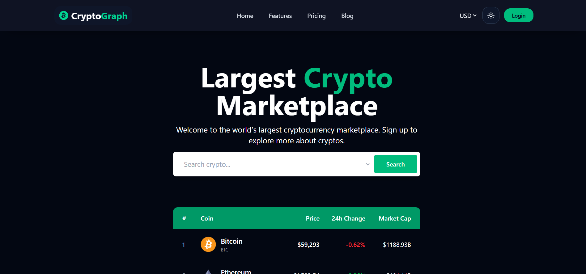
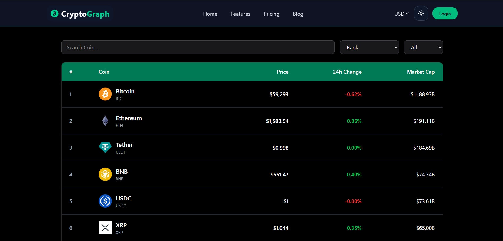
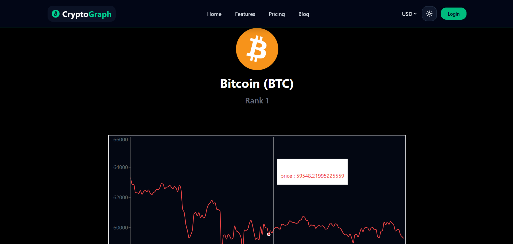

# CryptoGraph


CryptoGraph is a modern cryptocurrency market tracking web application built with React, Vite, and Tailwind CSS. It offers real-time market data, detailed coin insights, interactive charts, and a responsive interface designed for a smooth crypto experience.

## 📚 Table of Contents

- [✨ Overview](#-overview)
- [🚀 Live Demo](#-live-demo)
- [📸 Screenshots](#-screenshots)
- [✨ Features](#-features)
- [🛠 Tech Stack](#-tech-stack)
- [⚙️ Installation](#-installation)
- [📜 Available Scripts](#-available-scripts)
- [🧪 Usage](#-usage)
- [🔗 API Used](#-api-used)
- [📁 Project Structure](#-project-structure)
- [📱 Responsive Design](#-responsive-design)
- [🔮 Future Improvements](#-future-improvements)
- [🤝 Contributing](#-contributing)
- [📄 License](#-license)
- [👤 Author](#-author)
- [🙏 Acknowledgements](#-acknowledgements)

## ✨ Overview

CryptoGraph helps users stay updated with the latest cryptocurrency market trends. From live prices and market capitalization to detailed coin pages and historical charts, the app is built to provide a clean and intuitive experience for both beginners and crypto enthusiasts.

## 🚀 Live Demo

Live demo coming soon.

- Demo URL: https://crypto-graph-three.vercel.app

## 📸 Screenshots

The following screenshots are included in the repository under `public/screenshots`.








## ✨ Features

- Live cryptocurrency prices
- Search cryptocurrencies
- Coin details page
- Interactive historical price charts
- Top gainers and losers
- Market cap rankings
- Responsive design
- Loading skeletons
- Error handling
- Fast API integration
- Clean modern UI
- Dark emerald and black theme

## 🛠 Tech Stack

| Category | Technologies |
|----------|--------------|
| Frontend | React.js, Vite, JavaScript (ES6+) |
| Styling | Tailwind CSS, React Icons |
| Routing | React Router DOM |
| State Management | Context API |
| Charts | Chart.js / react-chartjs-2 |
| Data API | CoinGecko API |

## ⚙️ Installation

```bash
git clone <repository-url>
cd CryptoGraph
npm install
npm run dev
```

## 📜 Available Scripts

```bash
npm run dev
npm run build
npm run preview
```

## 🧪 Usage

1. Open the application in your browser.
2. Browse live crypto prices and market trends.
3. Use the search feature to find specific coins.
4. Click on a coin to view detailed information and charts.
5. Explore top gainers, losers, and market rankings.

## 🔗 API Used

This project uses the CoinGecko API to fetch:

- Cryptocurrency prices
- Market data
- Coin details
- Historical chart data

## 📁 Project Structure

```bash
CryptoGraph/
├── public/
├── src/
│   ├── assets/
│   ├── components/
│   ├── context/
│   ├── pages/
│   ├── App.jsx
│   └── main.jsx
├── package.json
├── vite.config.js
└── README.md
```

## 📱 Responsive Design

CryptoGraph is designed to provide a smooth experience across desktop, tablet, and mobile devices. The layout adapts to different screen sizes while preserving usability and visual consistency.

## 🔮 Future Improvements

- Add user authentication and watchlists
- Implement portfolio tracking
- Add price alerts and notifications
- Improve chart filtering and time-range options
- Support multi-currency conversion
- Add dark/light theme toggle

## 🤝 Contributing

Contributions are welcome! If you would like to improve this project, please follow these steps:

1. Fork the repository
2. Create your feature branch
3. Commit your changes
4. Push to the branch
5. Open a pull request

## 📄 License

This project is licensed under the MIT License.

## 👤 Author

Built by Your Name

## 🙏 Acknowledgements

- CoinGecko for providing cryptocurrency market data
- React, Vite, and Tailwind CSS communities
- Open-source contributors and inspiration from modern crypto dashboards

